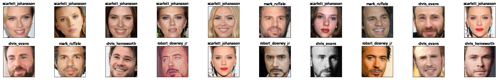

# Avengers Facial Recognition

This project uses State of the Art Facial Recognition model pruposed by Google called **FaceNet**. Facenet uses deep convolutional networks along with triplet loss to achieve state of the art accuracy. 

In this project we used **NN4 Small2 v1** , an Inception model with 96x96 images as input. We have used a pretrained model from [OpenFacePytorch](https://github.com/thnkim/OpenFacePytorch), which was trained on OpenFace Dataset. Transfer Learning was then applied to train the classifier on the Avengers Dataset.

We have also used **MTCNN** (MultiTask Cascaded Convolution Network) from [facenet-pytorch](https://github.com/timesler/facenet-pytorch) to crop and align the faces
    
## Installation

### Docker
A docker image for this project is Available here :   [jovian19/pytorch](https://hub.docker.com/r/jovian19/pytorch)

```bash
docker pull jovian19/pytorch
```

Run the docker container using this command
```bash
docker run --rm -it -v <our local dataset path>:/dataset jovain19/pytorch:latest bash
```

### Requirements

- [x] pytorch==1.8.1 
- [x] facenet-pytorch
- [x] numpy 
- [x] scikit-learn 
- [x] tqdm  
- [x] pillow 
- [x] matplotlib
- [x] torchvision 
- [x] torchaudio 
- [x] cudatoolkit=10.2

## Visualize the Avenger Dataset

The dataset contains around 50 cropped face images of each avenger. This dataset can be downloaded from here : https://www.kaggle.com/rawatjitesh/avengers-face-recognition

- chris_evans
- chris_hemsworth
- mark_ruffalo
- robert_downey_jr
- scarlett_johansson
  
Here is a subset of the dataset.


    

## Triplet Loss and Triplet Generator

Here we train the model such it learns the face embeddings **f(x)** from the image $x$ such that the squared L2 distance between all faces of the same identity is small and the distance between a pair of faces from different identities is large.

This can be achieved with a *triplet loss* __L__ as defined by 


This loss minimizes the distance between an anchor image *x<sup>a</sup>* and a positive image *x<sup>p</sup>*  and maximizes the between the anchor image *x<sup>a</sup>*  and a negative image *x<sup>n</sup>* 

The `generate_triplets` function generates these positive and negative images for the entire batch. The current implementation randomly chooses the positive and negative images from the current batch. This can easily be enhanced to select difficult triplets to make the model train better. 

The difficult triplet can be generated by selecting the positive image having the highest distance from the anchor and similarly selcting the negative image having smallest distance from the anchor


```python
# Generate triplets
def generate_triplets(images, labels):
    positive_images = []
    negative_images = []
    batch_size = len(labels)
    
    for i in range(batch_size):
        anchor_label = labels[i]

        positive_list = []
        negative_list = []

        for j in range(batch_size):
            if j != i:
                if labels[j] == anchor_label:
                    positive_list.append(j)
                else:
                    negative_list.append(j)

        positive_images.append(images[random.choice(positive_list)])
        negative_images.append(images[random.choice(negative_list)])

    positive_images = torch.stack(positive_images)
    negative_images = torch.stack(negative_images)
    
    return positive_images, negative_images

class TripletLoss(nn.Module):
    def __init__(self, alpha=0.2):
        super(TripletLoss, self).__init__()
        self.alpha = alpha
    
    def calc_euclidean(self, x1, x2):
        return (x1 - x2).pow(2).sum(1)
    
    def forward(self, anchor, positive, negative): # (batch_size , emb_size)
        distance_positive = self.calc_euclidean(anchor, positive)
        distance_negative = self.calc_euclidean(anchor, negative)
        losses = torch.relu(distance_positive - distance_negative + self.alpha)
        return losses.mean()

```

### Visualizing the Output

As we can see the model is able to generate the face embeddings for the dataset. Now if had to use just the distance between these embeddings to predict the faces, we would get an accuracy close to **96.5%**.

    

 
2D visualization of the embedded space using **TSNE**. From the below diagram we can see that the model is able to generate face embeddings that are easily distinguishable for different faces


    

# Transfer Learning a new classifier

The above model just outputs a face embedding for the image. To create a classifer for the __Avenger Dataset__ we add a new `nn.Linear` layer at the end, this layer takes in the face embedding and predicts the class label.

Since we only need to train the final layer, we freeze the parameters for all layers except the final layer. 

We also defined the **optimizer** to take only the final layer parameters and a `CrossEntropyLoss` function


# Using the Classifer for doing Predictions


    


    chris_evans with 98.71% probability
    


    


    scarlett_johansson with 94.83% probability
    

    

    


    chris_hemsworth with 99.09% probability
    


    

    


    UNKNOWN FACE, but similar to mark_ruffalo with 49.56% probability
    


    


    robert_downey_jr with 99.05% probability
    


    

    


    mark_ruffalo with 95.88% probability
    


    


    

